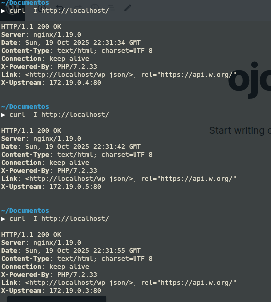
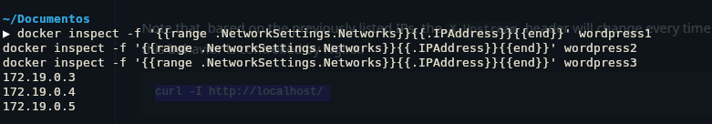
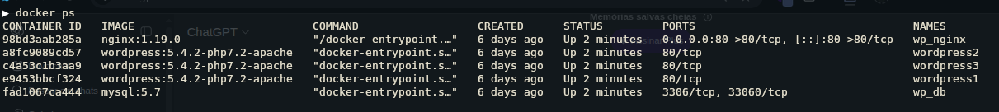
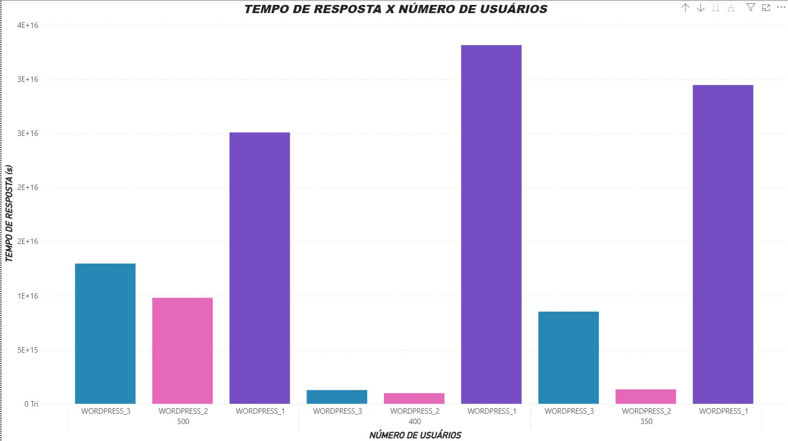
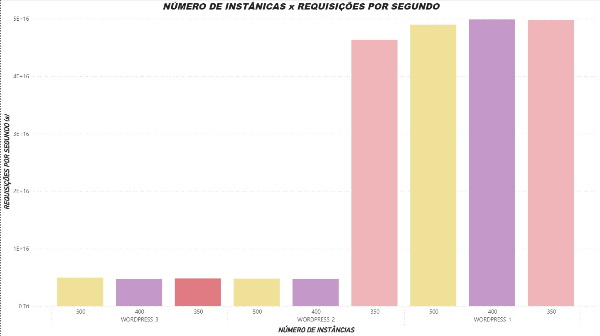

# Docker + Wordpress Instances (Trabalho 2)

## Project Setup

1. Download the images for MySQL and WordPress

```
docker-compose pull
```

2. Start the containers once the images are available

```
docker-compose up -d
```

3. Check the running containers — there should be **3 WordPress instances** and **1 Nginx**.

```
docker-compose ps
```

4. (Optional) Check if MySQL has started successfully.

```
docker-compose logs -f db
```

5. Open in your browser:

```
http://localhost/
```

Set up your WordPress account.

## To List the IPs of the WordPress Instances (Trabalho 2)

```
docker inspect -f '{{range .NetworkSettings.Networks}}{{.IPAddress}}{{end}}' wordpress1
docker inspect -f '{{range .NetworkSettings.Networks}}{{.IPAddress}}{{end}}' wordpress2
docker inspect -f '{{range .NetworkSettings.Networks}}{{.IPAddress}}{{end}}' wordpress3
```

## Test (Trabalho 2)

Run the command below and observe the **round-robin behavior** every time you create or refresh a page in WordPress.

Note that, based on the previously listed IPs, the `X-Upstream` header will change every time you execute it — this behavior is controlled by Nginx.

```
curl -I http://localhost/
```

## Evidence of Execution (Trabalho 2)

The following image shows the result of the docker-compose ps command, confirming that 3 WordPress containers, 1 MySQL, and 1 Nginx service are running as expected.



---

This image displays the output of the docker inspect command, where we can see the individual IP addresses assigned to each WordPress container.
These IPs are used by the load balancer (Nginx) to distribute requests.



---

The image below shows the results of consecutive executions of the curl -I http://localhost/ command.
Each response includes a different X-Upstream header value, demonstrating that the load balancing mechanism is successfully rotating between WordPress instances (Round Robin strategy).



---

# Wordpress Instances (Trabalho 3)

## Response Time x Number of Users

The first chart illustrates the relationship between user load and Response Time, measured in $\mu s$ (microseconds), although the magnitude of $10^{16}$ is unusually large for this unit. The WORDPRESS_1 configuration consistently shows the highest latency, peaking at approximately $3.8 \times 10^{16}$ $\mu s$ under 350 and 400 users, indicating it is the least responsive and provides the worst user experience regardless of the load level tested.



## Number of Instances x Requests per Second

The second chart, measuring Requests per Second ($\mu s$), showcases system throughput under various instance counts. Here, the WORDPRESS_1 configuration demonstrates a clear and substantial advantage, achieving the highest throughput across all instance counts and peaking around $5.2 \times 10^{16}$ $\mu s$ with 400 instances. This suggests that WORDPRESS_1 is optimized for processing the maximum volume of total requests.


